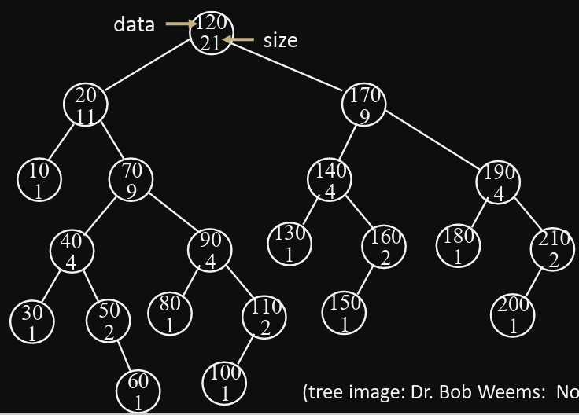

# ExamQuiz 3

## Recursive Tree Traversal

- Time Complexity: O(N)
    -  Asume do_something(h) is O(1)
  
- Space Complexity: O(TreeHeight) = O(N)
Here N is the number of nodes of the tree to be traversed. 

## Tree of Recursive Calls (TRC)
- The Tree of Recursive Calls (TRC) is a full tree where:
  -  Internal nodes of TRC correspond to function calls on the original tree nodes.
  -  Leaves of the TRC correspond to the calls for null.
- Leaves = Internal Nodes + 1

## Binary Tree
### Traversal

- Preorder: Root, Left, Right
  -   visit the node, then its left subtree, then its right subtree.
  -   Example based on image: 2, 3, 7, 1, 9, 5, 8, 4
- Inorder: Left, Root, Right
  -    visit the left subtree, then the node, then its right subtree.
  -    Example based on image: 1, 7, 3, 2, 5, 9, 8, 4
- Postorder: Left, Right, Root
  -    visit the left subtree, then the right subtree, then the node.
  -    Example based on image: 1, 7, 3, 5, 4, 8, 9, 2
- Levelorder: Breadth First Search (BFS)
  -    visit the nodes of the tree level by level (starting at level 0, that is, the root)  from left to right. 

The level of the root is defined to be 0.
The level of each node is +1 of its parent.
The depth of a node is the number of edges from the root to the node (It is equal to the level of that node).
The height of a node is the number of edges from the node to the deepest leaf. (If that node is the root, then the height is the deapth of deepest leaf.)

### Formulas
- Number of Nodes = 2height + 1 - 1
- A complete binary tree with N nodes has:
  -  floor(log2N) + 1 levels
  -  Height = floor(log2N)
  -  ceil(N/2) leaves (half the nodes are on the last level.)
  -  floor(N/2) internal nodes (half the nodes are internal nodes.)

### Properties of Full Trees
- Full Binary Tree: Every node has exactly 0 or 2 children. No nodes have only 1 child.
- A full binary tree with X internal nodes has:
  -  X + 1 external nodes.
  -  2X edges (links).
  -  N = 2X + 1 (Total number of nodes).
  -  Height at least log2N at most X.
  -  

### Time Complexity
Only _worst case_ is relevant.
| OPERATION | WORST CASE | BEST CASE |
| --- | --- | --- |
| Insert | O(N) | O(logN) |
| Search | O(N) | O(1) |
| Delete | O(N) | O(logN) |

### Space Complexity
| OPERATION | ITERATIVE | RECURSIVE AVERAGE |
| --- | --- | --- |
| Insert | O(1) | O(N^0.5) |
| Search | O(1) | O(N^0.5) |
| Delete | O(1) | O(N^0.5) |

## Binary Search Tree
The term "Search Tree" refers to a family of implementations, that may have different properties. 

A binary search tree is a binary tree where the item at each node is:
- Greater than or equal to all items on the left subtree.
- Less than or equal to all items on the right subtree.

In the following figure, the empty leaf could have the values 40, 41, 42, 43, 
Therefore, 40 <= X <= 43

### Traversal
Where is the smallest key? 
- The smallest key is the leftmost node.
Where is the largest key? 
- The largest key is the rightmost node.
What traversal prints the data in increasing order?
- Inorder traversal prints the data in increasing order. (Left, Root, Right)
How to print in decreasing order?
- Reverse Inorder traversal prints the data in decreasing order. (Right, Root, Left)

In the above image:
- Inorder: 10, 20, 30, 40, 50, 60, 70, 80, 90, 100, 110, 120, 130, 140, 150, 160, 170, 180, 190, 200, 210
- Preorder: 120, 20, 10, 70, 40, 30, 50, 60, 90, 80, 110, 100, 170, 140, 130, 160, 150, 190, 180, 210, 200
- Postorder: 10, 30, 60, 50, 40, 80, 100, 110, 90, 70, 20, 130, 150, 160, 140, 180, 200, 210, 190, 170, 1206

### Properties
- Successor of node x with key k (go right):
    -  The smallest node in the right subtree of x.
    -  Special case:
       -   No right subtree: first parent to the right.
   - Amogh's Note: Given a node, to find it's successor, find the next highest node. For example, in the image from traversal, the successor 60 is 70.
- Predecessor of node x with key k (go left):
    -  The largest node in the left subtree of x.
    -  Special case:
       -   No left subtree: first parent to the left. 
 - Amogh's Note: Given a node, to find it's predecessor, find the next lowest node. For example, in the image from traversal, the predecessor 130 is 120.

- Minumum: leftmost node.
  -  Special Case: No left child => root is the minimum.
- Maximum: rightmost node.
  -  Special Case: No right child => root is the maximum.

### Insertion
__Naïve Insertion__
To insert an item, the simplest approach is to travel down the tree until you find a leaf position wher eit is appropriate to insert the new item.

### Performance of BST
If items are inserted:
- Ascending order: The resulting tree is maximally imbalanced.
- Descending order: The resulting tree is maximally imbalanced.
- Random order: The resulting tree is balanced.

### Rotations

#### Right Rotation

P may or may not be a parent node.

1. Set A's left pointer to B's right pointer. (A->left = B->right)
2. Set B's right pointer to A. (B->right = A)
3. IF A has a parent node P, set P's left or right pointer to B. (P->left OR P->right = B)

#### Left Rotation

P may or may not be a parent node.

1. Set B's right pointer to A's left pointer. (B->right = A->left)
2. Set A's left pointer to B. (A->left = B)
3. IF B has a parent node P, set P's left or right pointer to A. (P->left OR P->right = A)

### Time Complexity
| OPERATION | WORST CASE | BEST CASE |
| --- | --- | --- |
| Insert | O(N) | O(1) |
| Search | O(N) | O(1) |
| Delete | O(N) | O(logN) |

### Space Complexity
| OPERATION | SPACE |
| --- | --- |
| Insert | O(N) |
| Search | O(N) |
| Delete | O(N) |

