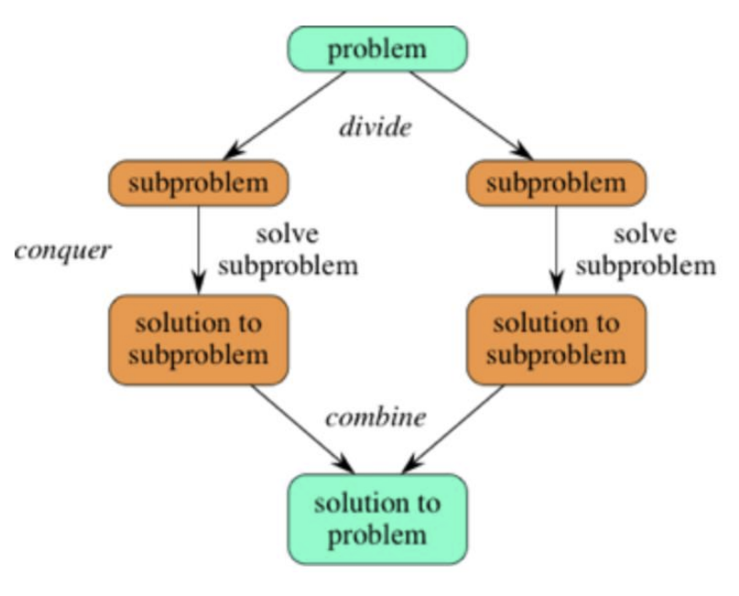
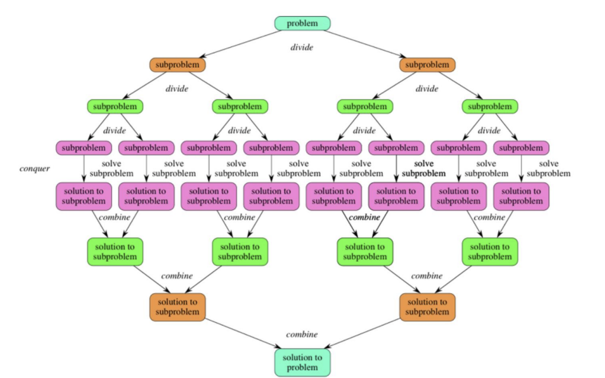
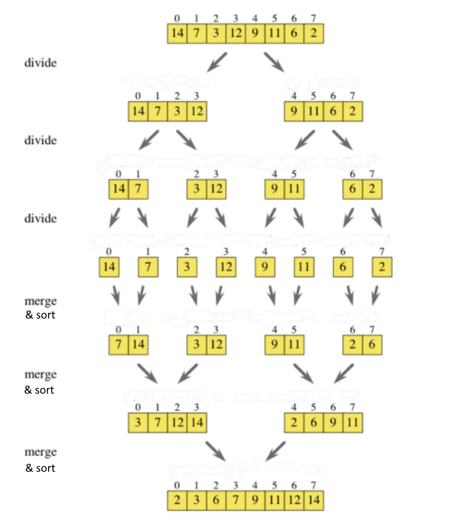
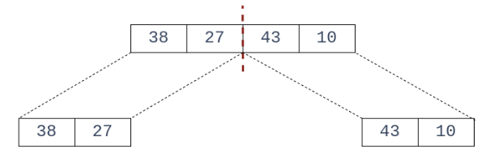
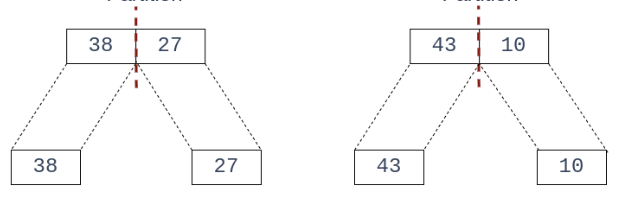
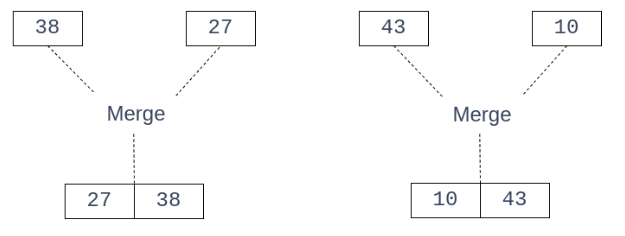
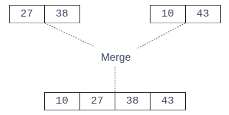

# Merge Sort

## Table of Contents

- [Merge Sort](#merge-sort)
  - [Table of Contents](#table-of-contents)
  - [Properties](#properties)
  - [Explanation](#explanation)
    - [Divide and Conquer](#divide-and-conquer)
    - [Merge Sort Theory](#merge-sort-theory)
      - [Merge Sort Example](#merge-sort-example)
  - [Code](#code)

## Properties

- **Stable**: Yes
- **Adaptive**: No
- **Time Complexity**: O(n log<sub>2</sub>n)
- **Space Complexity**: O(n)
  - Extra memory is needed to copy the array.
- Merge sort can be used with insertion sort for small problem sizes. This is because insertion sort is faster than merge sort for small problem sizes.
- There will be at most log<sub>2</sub>n *open* recursive calls.
- Better Cache usage than Quick Sort

## Explanation

In order to understand Merge sort, you first need to understand what "Divide and Conquer" means.

### Divide and Conquer



In the above image, you can see that the problem is divided into smaller sub-problems. These sub-problems are then solved and the solutions are combined to give the final solution.

Conquer means solving the sub-problems recursively. Divide means dividing the problem into smaller sub-problems.

Scaling up the image:



### Merge Sort Theory

Applying divide and conquer to sorting:

The full problem would be to sort an entire array.

The sub-problems would be to sort smaller sub-arrays (small portions of the original array). The size of these small portions would be 1. That means, you keep subdividing the array until you reach arrays of size 1.

To sort an array A[p .. r] where p is the first element and r is the last element, you do the following:

1. **Divide** by splitting the array into two subarrays. The two subarrays would be:
    - A[p .. q]
    - A[q+1 .. r]
  
   Here, q is the middle element of the array.
   That is, if p = 0, q would be r/2.

2. **Conquer** by recursively sorting the two subarrays A[p .. q] and A[q+1 .. r]. That is you keep repeating step 1 until you reach an array size of 1.

   *Note:* In this step, you are not actually sorting the subarrays. You are just dividing them into smaller subarrays.

3. **Combine** by merging the subarrays to produce a single array A[p .. r].

   *Note:* You are expected to sort the subarrays while merging them.



#### Merge Sort Example

Consider the following:
int arr[] = {38, 27, 43, 10};

1. **Divide**

    

2. **Conquer**

    

3. **Combine** (and sort)

    In this step, you are undoing the conquering. You are merging the subarrays and sorting them while merging.

    Step 1: Merge the subarrays in a sorted order. That is, check if 38 <= 27. It isn't so insert 27 first and then 38. Then do the second set of numbers. Check if 43 <= 10. It isn't so insert 10 first and then 43.
    - {38}, {27} -> {27, 38}
    - {43}, {10} -> {10, 43}
  
    

    Step 2: Merge the two sorted subarrays in a sorted order. That is, check if 27 <= 10. It isn't so insert 10 first. Then check if 27 <= 43. It is so insert 27. Then check if 38 <= 43. It is so insert 38. Now insert 43 at the end.
    - {27, 38}, {10, 43} -> {10, 27, 38, 43}
  
    

## Code

For a line by line explanation of the code, look at [merge_sort_explanation.c](merge_sort_explanation.c).

The explanation is best viewed in a code editor with the following extension:

Name: Better Comments

Description: Improve your code commenting by annotating with alert, informational, TODOs, and more!

VS Marketplace Link: <https://marketplace.visualstudio.com/items?itemName=aaron-bond.better-comments>

It will allow for color coded comments.

```c
void merge(int array[], int left, int mid, int right) {
  
  int size_of_left = mid - left + 1;
  int size_of_right = right - mid;

  int i, j, k; 

  int temp_left[size_of_left], temp_right[size_of_right]; 

  for (i = 0; i < size_of_left; i++)
    temp_left[i] = array[left + i];

  for (j = 0; j < size_of_right; j++)
    temp_right[j] = array[mid + 1 + j];

  i = 0;
  j = 0;
  k = left;

  while ((i < size_of_left) && (j < size_of_right)) {
    if (temp_left[i] <= temp_right[j]) {
      array[k] = temp_left[i];
      i++;
    } else {
      array[k] = temp_right[j];
      j++;
    }

    k++;
  }

  while (i < size_of_left) {
    array[k] = temp_left[i];
    i++;
    k++;
  }

  while (j < size_of_right) {
    array[k] = temp_right[j];
    j++;
    k++;
  }
}

void merge_sort(int array[], int left, int right) 
{
  if (left >= right) 
    return;
  else {
    int mid = (left + right) / 2; 

    merge_sort(array, left, mid);    
    merge_sort(array, mid + 1, right);
    merge(array, left, mid, right); 
  }
}

```
