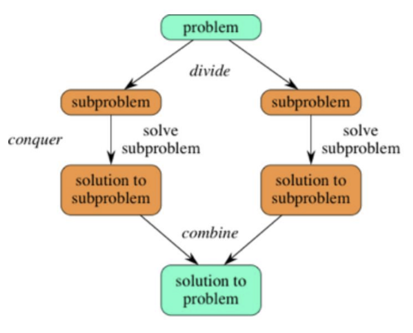
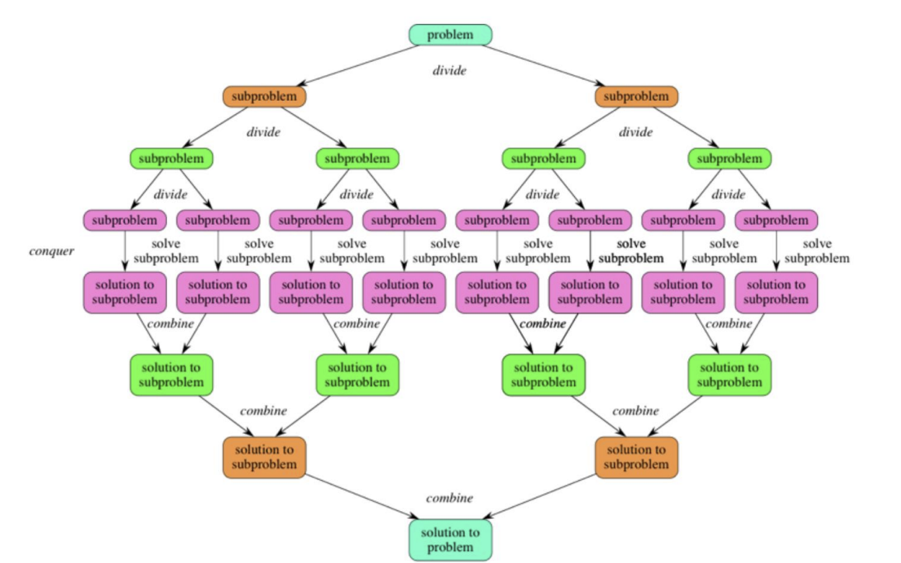
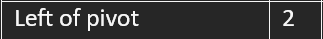

# Quick Sort

## Table of Contents

- [Quick Sort](#quick-sort)
  - [Table of Contents](#table-of-contents)
  - [Properties](#properties)
  - [Explanation](#explanation)
    - [Divide and Conquer](#divide-and-conquer)
    - [Quick Sort](#quick-sort-1)
      - [Performing Quick Sort on an Array](#performing-quick-sort-on-an-array)
  - [Code](#code)

## Properties

- **Stable**: No
- **Adaptive**: No
- **Time Complexity**:
  - Best: O(n log<sub>2</sub>n)
  - Average: O(n log<sub>2</sub>n)
  - Worst: O(n<sup>2</sup>)
- **Space Complexity**: O(log<sub>2</sub>n)

## Explanation

Similar to Merge sort, you need to understand what "Divide and Conquer" means.
You can skip this section if you have already read through the "Divide and Conquer" section in the [merge sort readme](../Merge%20Sort/readme.md).

### Divide and Conquer



In the above image, you can see that the problem is divided into smaller sub-problems. These sub-problems are then solved and the solutions are combined to give the final solution.

Conquer means solving the sub-problems recursively. Divide means dividing the problem into smaller sub-problems.

Scaling up the image:



### Quick Sort

Applying divide and conquer to sorting:

The full problem would be to sort an entire array.

The sub-problems would be to sort smaller sub-arrays (small portions of the original array). The size of these small portions would be 1. That means, you keep subdividing the array until you reach arrays of size 1.

To sort an array A[p .. r] where p is the first element and r is the last element, you do the following:

1. **Divide:**
   1. Choose any element in the array A[p .. r] and call this element the *pivot*.
   2. Rearrange the array such that all the elements less than or equal to the *pivot* are to the left of the *pivot* and all the elements greater than the *pivot* are to the right of the pivot. This is called *partitioning*.
   3. Note the index of the pivot after partitioning. Let's call this index q. That is, the pivot ends up at index q after partitioning.

   *Note*: At this point, the order of the elements on either side of the pivot don't matter. They just need to be on the correct side of the pivot.

   <ins>*Note*</ins>: The pivot can be any element in the array. It is usually the first, middle or last element. Most commonly the last element. We will be using the last element as the pivot.

2. **Conquer:**
    1. Recursively sort the array A[p .. q-1], that is, all elements to the left of the pivot. (Less than or equal to the pivot).
    2. Recursively sort the array A[q+1 .. r], that is, all elements to the right of the pivot. (Greater than the pivot).

    *Note:* Recursively sorting means you are calling the same function again. So, you are repeating steps 1 and 2 until the entire array is sorted.

3. **Combine:**
    There is nothing to be done here. The array is already sorted. Quick sort sorts in place so it does not require combining.

#### Performing Quick Sort on an Array

Assume the array is [9, 7, 5, 11, 12, 2, 14, 3, 10, 6]. Call the function quick_sort(A, 0, 9) where A is the array, 0 is the first index and 9 is the last index.


- Pivot = 6


- Perform partitioning


- q = 3 (index counting starts from 0. So, the pivot is at index 3)

Now the array is partitioned into two subarrays. The subarray to the left of the pivot contains elements less than or equal to the pivot, [5, 2, 3]. The subarray to the right of the pivot contains elements greater than the pivot, [9, 7, 11, 12, 14, 10].

Considering the array to the left of the pivot, [5, 2, 3], let's call this "Subarray #1". Recursively call the function quick_sort(A, 0, 2) where A is the array, 0 is the first index and 2 is the last index.


- Consider a new pivot. Pivot = 3


- Perform partitioning


- q = 1

This subarray is now partitioned into two subarrays. The subarray to the left of the pivot contains elements less than or equal to the pivot, [2]. The subarray to the right of the pivot contains elements greater than the pivot, [5].

Considering the array to the left of the pivot, [2],let's call this "Subarray #2". Recursively call the function quick_sort(A, 0, 0) where A is the array, 0 is the first index and 0 is the last index.



- Consider a new pivot. Pivot = 2
- Perform partitioning
- This is the base case so the function will do nothing.

Considering the array to the right of the pivot, [5], let's call this "Subarray #3". Recursively call the function quick_sort(A, 2, 2) where A is the array, 2 is the first index and 2 is the last index.


- Consider a new pivot. Pivot = 5
- Perform partitioning
- This is the base case so the function will do nothing.

Now, Subarray #1 is fully sorted. The array is now [2, 3, 5].

The entire array is now <ins>[2, 3, 5][6]</ins>[9, 7, 11, 12, 14, 10].

Considering the array to the right of the pivot, [9, 7, 11, 12, 14, 10], let's call this "Subarray #4". Recursively call the function quick_sort(A, 4, 9) where A is the array, 4 is the first index and 9 is the last index.


- Consider a new pivot. Pivot = 10


- Perform partitioning


- q = 2

This subarray is now partitioned into two subarrays. The subarray to the left of the pivot contains elements less than or equal to the pivot, [9, 7]. The subarray to the right of the pivot contains elements greater than the pivot, [11, 12, 14].

Considering the array to the left of the pivot, [9, 7], let's call this "Subarray #5". Recursively call the function quick_sort(A, 4, 5) where A is the array, 4 is the first index and 5 is the last index.


- Consider a new pivot. Pivot = 7


- Perform partitioning


This subarray is now partitioned into two subarrays. The subarray to the left of the pivot contains elements less than or equal to the pivot, []. The subarray to the right of the pivot contains elements greater than the pivot, [9].

Since the subarray to the left of the pivot is empty, there is no need to partition it.

Considering the array to the right of the pivot, [9], let's call this "Subarray #6". Recursively call the function quick_sort(A, 5, 5) where A is the array, 5 is the first index and 5 is the last index.


- Consider a new pivot. Pivot = 9
- Perform partitioning
- This is the base case so the function will do nothing.

Now, Subarray #5 is fully sorted. The array is now [7, 9].

The entire array is now <ins>[2, 3, 5][6][7, 9][10]</ins>[11, 12, 14].

Considering the array to the right of the pivot, [11, 12, 14], let's call this "Subarray #7". Recursively call the function quick_sort(A, 7, 9) where A is the array, 7 is the first index and 9 is the last index.


- Consider a new pivot. Pivot = 14


- Perform partitioning


- q = 2

This subarray is now partitioned into two subarrays. The subarray to the left of the pivot contains elements less than or equal to the pivot, [11, 12]. The subarray to the right of the pivot contains elements greater than the pivot, [].

Since the subarray to the right of the pivot is empty, there is no need to partition it.

Considering the array to the left of the pivot, [11, 12], let's call this "Subarray #8". Recursively call the function quick_sort(A, 7, 8) where A is the array, 7 is the first index and 8 is the last index.


- Consider a new pivot. Pivot = 12


- Perform partitioning


- q = 1

This subarray is now partitioned into two subarrays. The subarray to the left of the pivot contains elements less than or equal to the pivot, [11]. The subarray to the right of the pivot contains elements greater than the pivot, [].

Since the subarray to the right of the pivot is empty, there is no need to partition it.

Considering the array to the left of the pivot, [11], let's call this "Subarray #9". Recursively call the function quick_sort(A, 7, 7) where A is the array, 7 is the first index and 7 is the last index.


- Consider a new pivot. Pivot = 11
- Perform partitioning
- This is the base case so the function will do nothing.

Now, Subarray #8 is fully sorted. The array is now [11, 12].

The entire array is now <ins>[2, 3, 5][6][7, 9][10][11, 12][14]</ins>.

Array A = [2, 3, 5, 6, 7, 9, 10, 11, 12, 14].

Now the entire array has been sorted.

## Code

For a line by line explanation of the code, look at [quick_sort_explanation.c](quick_sort_explanation.c).

The explanation is best viewed in a code editor with the following extension:

Name: Better Comments

Description: Improve your code commenting by annotating with alert, informational, TODOs, and more!

VS Marketplace Link: <https://marketplace.visualstudio.com/items?itemName=aaron-bond.better-comments>

It will allow for color coded comments.

```c
void swap(int *SwapA, int *SwapB) {
  int temp = *SwapA;
  *SwapA = *SwapB;
  *SwapB = temp;
}

int partition(int A[], int low, int high) {
  int i, j = 0;
  int pivot = A[high];
  i = (low - 1);
  for (j = low; j < high; j++) {
    if (A[j] < pivot) {
      i++;
      swap(&A[i], &A[j]);
    }
  }
  swap(&A[i + 1], &A[high]);
  return (i + 1);
}

void QuickSort(int A[], int low, int high) {
  if (low < high) {
    int ndx = partition(A, low, high);
    QuickSort(A, low, ndx - 1);
    QuickSort(A, ndx + 1, high);
  }
}
```
